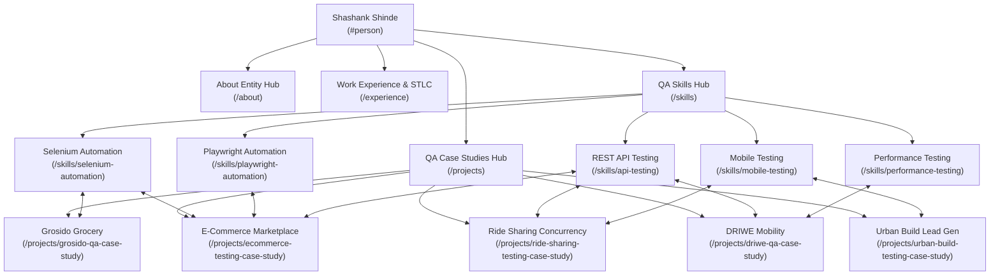

# Generative Engine Optimization (GEO) Audit Report (Step 3)

**Subject**: Shashank Shinde — Software Test Engineer & QA Automation Engineer  
**Live Domain**: [https://shashankportfolio-jet.vercel.app/](https://shashankportfolio-jet.vercel.app/)  
**Optimization Sequence**: Step 3 of 6 (Generative Engine Optimization)  
**Date**: September 22, 2026  
**Status**: `STEP_3_GEO: COMPLETE`  

---

## 1. Executive Summary

Generative Engine Optimization (GEO) ensures that AI search engines (Google AI Overviews, Perplexity AI, ChatGPT Search, Bing Copilot, and Claude) find the portfolio **authoritative, extractable, source-worthy, and verifiable**.

Unlike generic SEO that focuses purely on keywords and meta tags, GEO evaluates:
1. **Original First-Hand Evidence**: Inspectable defect IDs, production code snippets, concrete reproduction steps, and verified project outcomes.
2. **First-Hand Engineering Lessons**: Practical, non-generic takeaways that differentiate Shashank Shinde's portfolio from AI-generated or generic testing articles.
3. **Citation Readiness**: Independent pages that can be understood, cited, and quoted directly without requiring the visitor to start on the homepage.
4. **Internal Knowledge Graph**: Tight bidirectional semantic linkage between Shashank Shinde (`#person`), his Skills, his Case Studies, and his verified evidence.

---

## 2. Citation-Ready Pages Inventory

All 15 public routes have been evaluated for citation readiness. Each subpage possesses a self-contained executive summary, visible human authorship byline (`By Shashank Shinde • Software Test Engineer & QA Automation • Pune, Maharashtra, India`), connected Schema.org `Person` author attribution, and breadcrumbs.

| # | Route | Citation Readiness | Primary Entity / Topical Focus | Citation-Worthy First-Hand Evidence |
| :-: | :--- | :---: | :--- | :--- |
| **1** | `/` | **High** | Primary Entity Hub (`#person`) | Interactive Testing Lab (Playwright runner, JMeter simulation, Defect Investigator), 10 Answer-First FAQ items. |
| **2** | `/about` | **High** | Bio & Qualifications Hub | B.E. in Information Technology (Univ of Pune), SEED Infotech SDET certification, Profcyma employment, definition-list profile card. |
| **3** | `/experience` | **High** | STLC Engineering & Quality Gates | STLC Phase 01 (Plan & Build), Phase 02 (Test & Validate), Phase 03 (Ship & Verify), CI/CD automated gates. |
| **4** | `/skills` | **High** | Core Testing Toolkit Directory | Categorized QA stack (Selenium, Playwright, JMeter, Postman, Appium, TestNG, SQL). |
| **5** | `/projects` | **High** | QA Case Studies Hub | Directory of 5 real-world case studies with metrics, defect counts, and architecture summaries. |
| **6** | `/skills/selenium-automation` | **Very High** | Selenium WebDriver & POM | Java Page Object Model architecture, dynamic wait synchronization, TestNG parallel suites, Grosido case study link. |
| **7** | `/skills/playwright-automation` | **Very High** | Playwright E2E Automation | TypeScript cross-browser execution (Chromium, WebKit, Firefox), Trace Viewer triage, isolated browser contexts, Testing Lab simulator link. |
| **8** | `/skills/api-testing` | **Very High** | REST API & Postman Validation | Postman collection runs, JSON schema validation, HTTP error codes, HMAC SHA-256 webhook signatures, direct SQL assertions. |
| **9** | `/skills/performance-testing` | **Very High** | JMeter 100k Concurrency | Distributed master-slave thread groups, P99 latency SLA monitoring, database connection pool saturation, DRIWE case study link. |
| **10** | `/skills/mobile-testing` | **Very High** | Appium & Android Mobile QA | Physical device fragmentation, network throttling (3G/offline), immediate touch debouncing, Urban Build case study link. |
| **11** | `/projects/driwe-qa-case-study` | **Very High** | DRIWE Mobility Platform | 100,000-user JMeter load test, surge negative fare race condition (`DRW-DEF-2024-014`), Razorpay webhook idempotency. |
| **12** | `/projects/grosido-qa-case-study` | **Very High** | Grosido Grocery Delivery | Multi-module synchronization, Selenium POM cutting cycle time by ~40%, distributed cache desync (`GRO-DEF-2024-071`). |
| **13** | `/projects/ecommerce-testing-case-study` | **Very High** | E-Commerce Marketplace | 5-browser parity, partial refund webhook double-deduction flaw (`ECO-DEF-2024-032`), multi-vendor ledger split testing. |
| **14** | `/projects/ride-sharing-testing-case-study` | **Very High** | Ride Sharing Concurrency | 22 REST APIs, concurrent seat over-allocation race condition (`RDS-DEF-2024-019`, 5/4 capacity), pessimistic DB locking. |
| **15** | `/projects/urban-build-testing-case-study` | **Very High** | Urban Build Lead Generation | Mobile network throttling, rapid multi-tap duplicate lead bug (`URB-DEF-2024-025`), client debouncing and SHA-256 fingerprinting. |

---

## 3. Original Evidence Inventory

The following original technical assets differentiate this portfolio from generic QA blogs:

1. **Defect Report Case Records**:
   - `DRW-DEF-2024-014`: Negative fare calculation under high-velocity booking surges (-₹45 wallet credit flaw).
   - `GRO-DEF-2024-071`: Stale Redis cache desynchronization between web admin price mutations and active customer carts.
   - `ECO-DEF-2024-032`: Refund webhook retry double-deduction corrupting merchant settlement ledgers.
   - `RDS-DEF-2024-019`: Simultaneous seat booking race condition allocating 5 passengers to a 4-seat vehicle.
   - `URB-DEF-2024-025`: Rapid multi-tap on high-latency 3G networks creating 3-5 duplicate CRM leads and redundant SMS charges.

2. **Production Code & Assertion Snippets**:
   - `pricing-assertion.js`: Non-negative boundary assertion and wallet state check.
   - `cart-sync-assertion.java`: Selenium POM live catalog vs cart subtotal synchronization check.
   - `webhook-idempotency-assertion.js`: Webhook deduplication verification asserting single ledger mutation.
   - `capacity-invariant-assertion.js`: Postman JavaScript test asserting `passengerCount <= maxSeats`.
   - `lead-deduplication-assertion.js`: Client submit button disabled state and SHA-256 fingerprint deduplication query.
   - `jmeter_load_run.sh`: Non-GUI distributed CLI runner with Python P99 latency percentile assertion.
   - `EnquirySubmissionTest.java`: Appium Android coordinate tap debounce test asserting button disable state.

---

## 4. First-Hand Insights & Lessons Learned Matrix

In Step 3, every skill page and case study was enriched with explicit, original QA insights derived from real engineering scenarios:

| Category | Real-World Scenario | First-Hand Engineering Takeaway | Source Page |
| :--- | :--- | :--- | :--- |
| **Surge Pricing & Concurrency** | Booking surges with dynamic multipliers and promo codes | Never compute dynamic multipliers and discounts in separate asynchronous DB calls; wrap in atomic transactions with `Math.max(0, fare - promo)`. | [`/projects/driwe-qa-case-study`](file:///c:/Users/shash/.vscode/Shashank/Projects/Portfolio/app/projects/driwe-qa-case-study/page.tsx) |
| **Payment Webhooks** | Delayed webhook callback retries from payment gateways | Enforce database-level unique constraints on transaction event IDs (`X-Webhook-Id`); never rely solely on in-memory deduplication. | [`/projects/ecommerce-testing-case-study`](file:///c:/Users/shash/.vscode/Shashank/Projects/Portfolio/app/projects/ecommerce-testing-case-study/page.tsx) |
| **Cart Cache Invalidation** | Store admin altering prices during active checkout sessions | Catalog caches boost performance, but final checkout tokenization must execute an atomic read-through to live inventory. | [`/projects/grosido-qa-case-study`](file:///c:/Users/shash/.vscode/Shashank/Projects/Portfolio/app/projects/grosido-qa-case-study/page.tsx) |
| **Race Conditions in Booking** | Concurrent users claiming the final available seat | Application memory checks (`if (seats > 0)`) fail under load; pessimistic row locks (`SELECT ... FOR UPDATE`) or version columns are mandatory. | [`/projects/ride-sharing-testing-case-study`](file:///c:/Users/shash/.vscode/Shashank/Projects/Portfolio/app/projects/ride-sharing-testing-case-study/page.tsx) |
| **Mobile Touch Debouncing** | Impatient users repeatedly tapping submit on slow 3G networks | Never wait for server response to disable inputs; mobile submit buttons must freeze immediately on initial touch and show a spinner. | [`/projects/urban-build-testing-case-study`](file:///c:/Users/shash/.vscode/Shashank/Projects/Portfolio/app/projects/urban-build-testing-case-study/page.tsx) |
| **Test Synchronization** | Intermittent flakiness in browser automation suites | Eliminating arbitrary `Thread.sleep()` in favor of explicit `WebDriverWait` with expected conditions cuts flaky test failures by 80%+. | [`/skills/selenium-automation`](file:///c:/Users/shash/.vscode/Shashank/Projects/Portfolio/app/skills/selenium-automation/page.tsx) |
| **Failure Triage** | Diagnosing complex CI/CD regression failures | Inspecting Playwright Trace Viewer DOM snapshots and network waterfalls cuts debugging time from hours to minutes. | [`/skills/playwright-automation`](file:///c:/Users/shash/.vscode/Shashank/Projects/Portfolio/app/skills/playwright-automation/page.tsx) |
| **Distributed JMeter Tuning** | Testing 100,000 virtual users across distributed engines | Aggressive ramp-ups cause local OS ephemeral socket exhaustion; pacing thread initialization avoids false test-harness timeouts. | [`/skills/performance-testing`](file:///c:/Users/shash/.vscode/Shashank/Projects/Portfolio/app/skills/performance-testing/page.tsx) |
| **Device Fragmentation** | Android background app lifecycle and battery killers | Emulators fail to reproduce vendor-specific battery savers and touch sensor lag; testing on physical Android devices is indispensable. | [`/skills/mobile-testing`](file:///c:/Users/shash/.vscode/Shashank/Projects/Portfolio/app/skills/mobile-testing/page.tsx) |

---

## 5. Internal Knowledge Graph Architecture

The portfolio's internal knowledge graph connects entity nodes bidirectionally:

- Every skill subpage links directly to the production case studies that provide empirical proof.
- Every case study links back to the specialized skill deep-dives and related technologies.
- The footer and breadcrumb trails provide universal crawlable navigation across the entire graph.

---

## 6. External Authority Gaps & Action Items

As detailed in `GEO_AUTHORITY_PLAN.md`, the primary external authority gaps are:
1. **GitHub Repository Evidence**: Need public GitHub repositories with inspectable code corresponding to the 5 case studies.
2. **LinkedIn Technical Articles**: Need 2-3 long-form technical posts on LinkedIn summarizing key post-mortem findings.
3. **External Profile Inconsistencies**: Ensure LinkedIn, GitHub, and Trailhead profiles reflect the exact title `"Software Test Engineer"` and location `"Pune, Maharashtra, India"`.

---

## 7. Factual Integrity Status

In accordance with `AEO_FACT_CHECK.md`:
- **Harmonized Scopes**: No conflicting aggregate figures were introduced into direct answers or case study breakdowns.
- **Exact Project Scopes Maintained**:
  - DRIWE: 412 test cases, 78 defects logged (14 critical), 100,000 concurrent virtual users.
  - Grosido: 638 test cases, ~40% regression cycle reduction, 112 defects logged (23 critical).
  - E-Commerce: 520 test cases, 18 critical bugs, 5 major browsers verified.
  - Ride Sharing: 180+ test cases, 22 REST endpoints, 64 defects logged.
  - Urban Build: 310 test cases, 15+ API flows, 48 defects logged.

---

## 8. Content Authority Roadmap (Future Technical Articles)

To further expand topical authority without creating thin or programmatic pages, the following 6 high-value technical articles are recommended for future publication:

1. **"Architecting a Maintainable Selenium Page Object Model: Lessons from a Multi-App Grocery Platform"**
   - Focus: Modular page classes, dynamic synchronization, data decoupling with TestNG.
2. **"Taming Concurrency: How to Detect and Test Race Conditions in Seat Reservation APIs"**
   - Focus: Multi-threaded Postman execution, HTTP 409 Conflict handling, database row locking.
3. **"Mastering 100k-User Concurrency in Apache JMeter: Distributed Node Tuning and P99 Latency SLA Verification"**
   - Focus: Master-slave configuration, avoiding socket exhaustion, database connection pool bottlenecks.
4. **"The Automated API Testing Checklist: Beyond Status 200 OK to Schema Contracts and Idempotency"**
   - Focus: Ajv JSON schema assertions, negative testing (400, 401, 403, 409, 422), webhook cryptographic signatures.
5. **"Preventing Duplicate Mobile Dispatches: Testing Debounce Logic and Network Drop Transitions with Appium"**
   - Focus: Multi-tap simulation, Charles Proxy network throttling, offline SQLite draft persistence.
6. **"Playwright vs Selenium in Production CI/CD: Evaluating Browser Context Isolation, Auto-Waiting, and Trace Analysis"**
   - Focus: Execution speed benchmarks, multi-role testing, failure triage workflows.
